# Beads Export

*Generated: Sun, 21 Dec 2025 22:53:40 +07*

## Summary

| Metric | Count |
|--------|-------|
| **Total** | 15 |
| Open | 0 |
| In Progress | 0 |
| Blocked | 0 |
| Closed | 15 |

## Table of Contents

- [⚫ autoresetlol-0fb Update: Separate Cancel and Find Match coordinates](#autoresetlol-0fb)
- [⚫ autoresetlol-9ei Fix: Calibration color error due to mouse hover](#autoresetlol-9ei)
- [⚫ autoresetlol-u0f Fix: PyInstaller missing hidden imports for Pillow/PyScreeze](#autoresetlol-u0f)
- [⚫ autoresetlol-2e9 Fix: Missing Pillow dependency for PyAutoGUI](#autoresetlol-2e9)
- [⚫ autoresetlol-3ki Core: Bot Logic & Threading Engine](#autoresetlol-3ki)
- [⚫ autoresetlol-bvj Epic: The Anti-Fate Engine - Auto Accept & Reset Queue](#autoresetlol-bvj)
- [⚫ autoresetlol-dhd Feature: Persistent Supervisor Logic](#autoresetlol-dhd)
- [⚫ autoresetlol-dtv Refactor: Add Window Focus Logic](#autoresetlol-dtv)
- [⚫ autoresetlol-lm1 Setup: Project Structure & Config Manager](#autoresetlol-lm1)
- [⚫ autoresetlol-cag UI: Tkinter Dashboard Implementation](#autoresetlol-cag)
- [⚫ autoresetlol-30f Release Notes: AntiFateEngine V6](#autoresetlol-30f)
- [⚫ autoresetlol-15g Build: PyInstaller Packaging](#autoresetlol-15g)
- [⚫ autoresetlol-65h Feature: Calibration Helper](#autoresetlol-65h)
- [⚫ autoresetlol-gw7 Clarify project goal and Obsidian syntax usage](#autoresetlol-gw7)
- [⚫ autoresetlol-1p0 Docs: V6 User Guide](#autoresetlol-1p0)

---

## Dependency Graph

```mermaid
graph TD
    classDef open fill:#50FA7B,stroke:#333,color:#000
    classDef inprogress fill:#8BE9FD,stroke:#333,color:#000
    classDef blocked fill:#FF5555,stroke:#333,color:#000
    classDef closed fill:#6272A4,stroke:#333,color:#fff

    autoresetlol-0fb["autoresetlol-0fb<br/>Update: Separate Cancel and Find Matc..."]
    class autoresetlol-0fb closed
    autoresetlol-15g["autoresetlol-15g<br/>Build: PyInstaller Packaging"]
    class autoresetlol-15g closed
    autoresetlol-1p0["autoresetlol-1p0<br/>Docs: V6 User Guide"]
    class autoresetlol-1p0 closed
    autoresetlol-2e9["autoresetlol-2e9<br/>Fix: Missing Pillow dependency for Py..."]
    class autoresetlol-2e9 closed
    autoresetlol-30f["autoresetlol-30f<br/>Release Notes: AntiFateEngine V6"]
    class autoresetlol-30f closed
    autoresetlol-3ki["autoresetlol-3ki<br/>Core: Bot Logic & Threading Engine"]
    class autoresetlol-3ki closed
    autoresetlol-65h["autoresetlol-65h<br/>Feature: Calibration Helper"]
    class autoresetlol-65h closed
    autoresetlol-9ei["autoresetlol-9ei<br/>Fix: Calibration color error due to m..."]
    class autoresetlol-9ei closed
    autoresetlol-bvj["autoresetlol-bvj<br/>Epic: The Anti-Fate Engine - Auto Acc..."]
    class autoresetlol-bvj closed
    autoresetlol-cag["autoresetlol-cag<br/>UI: Tkinter Dashboard Implementation"]
    class autoresetlol-cag closed
    autoresetlol-dhd["autoresetlol-dhd<br/>Feature: Persistent Supervisor Logic"]
    class autoresetlol-dhd closed
    autoresetlol-dtv["autoresetlol-dtv<br/>Refactor: Add Window Focus Logic"]
    class autoresetlol-dtv closed
    autoresetlol-gw7["autoresetlol-gw7<br/>Clarify project goal and Obsidian syn..."]
    class autoresetlol-gw7 closed
    autoresetlol-lm1["autoresetlol-lm1<br/>Setup: Project Structure & Config Man..."]
    class autoresetlol-lm1 closed
    autoresetlol-u0f["autoresetlol-u0f<br/>Fix: PyInstaller missing hidden impor..."]
    class autoresetlol-u0f closed

    autoresetlol-15g ==> autoresetlol-3ki
    autoresetlol-15g -.-> autoresetlol-bvj
    autoresetlol-15g ==> autoresetlol-cag
    autoresetlol-3ki -.-> autoresetlol-bvj
    autoresetlol-3ki ==> autoresetlol-lm1
    autoresetlol-65h -.-> autoresetlol-bvj
    autoresetlol-cag ==> autoresetlol-65h
    autoresetlol-cag -.-> autoresetlol-bvj
    autoresetlol-cag ==> autoresetlol-lm1
    autoresetlol-lm1 -.-> autoresetlol-bvj
```

---

## ✨ autoresetlol-0fb Update: Separate Cancel and Find Match coordinates

| Property | Value |
|----------|-------|
| **Type** | ✨ feature |
| **Priority** | 🔥 Critical (P0) |
| **Status** | ⚫ closed |
| **Created** | 2025-12-21 15:39 |
| **Updated** | 2025-12-21 15:42 |
| **Closed** | 2025-12-21 15:42 |

### Description

Game UI thay đổi, nút Hủy và Tìm Trận không trùng nhau. Cần tách tọa độ.

### Acceptance Criteria

- [ ] Config has cancel_button_pos.\n- [ ] Bot clicks separate coordinates for reset.

### Design

Add cancel_button_pos to config. Update bot logic to click cancel pos then find pos.

---

## 🐛 autoresetlol-9ei Fix: Calibration color error due to mouse hover

| Property | Value |
|----------|-------|
| **Type** | 🐛 bug |
| **Priority** | 🔥 Critical (P0) |
| **Status** | ⚫ closed |
| **Created** | 2025-12-20 22:27 |
| **Updated** | 2025-12-20 22:29 |
| **Closed** | 2025-12-20 22:29 |

### Description

Logic lấy màu bị sai do hiệu ứng hover. Cần di chuột ra chỗ khác trước khi lấy màu.

### Acceptance Criteria

- [ ] Mouse moves away automatically during calibration.\n- [ ] Color captured is the non-hover color.

### Design

Update gui.py: Get Pos -> Move Mouse Away -> Wait -> Get Color at Pos.

---

## 🐛 autoresetlol-u0f Fix: PyInstaller missing hidden imports for Pillow/PyScreeze

| Property | Value |
|----------|-------|
| **Type** | 🐛 bug |
| **Priority** | 🔥 Critical (P0) |
| **Status** | ⚫ closed |
| **Created** | 2025-12-20 22:22 |
| **Updated** | 2025-12-20 22:23 |
| **Closed** | 2025-12-20 22:23 |

### Description

Build lại EXE với hidden imports vì lỗi runtime thiếu thư viện.

### Acceptance Criteria

- [ ] EXE runs without import error.

### Design

Add explicit imports in main.py. Use --hidden-import flag during build.

---

## 🐛 autoresetlol-2e9 Fix: Missing Pillow dependency for PyAutoGUI

| Property | Value |
|----------|-------|
| **Type** | 🐛 bug |
| **Priority** | 🔥 Critical (P0) |
| **Status** | ⚫ closed |
| **Created** | 2025-12-20 22:00 |
| **Updated** | 2025-12-20 22:02 |
| **Closed** | 2025-12-20 22:02 |

### Description

User báo lỗi failed to get pixel info. PyAutoGUI cần Pillow để lấy màu pixel.

### Acceptance Criteria

- [ ] Pillow installed.\n- [ ] pixel() works.\n- [ ] Rebuilt EXE works.

### Design

Install Pillow -> Test pixel() function -> Rebuild EXE.

---

## 📋 autoresetlol-3ki Core: Bot Logic & Threading Engine

| Property | Value |
|----------|-------|
| **Type** | 📋 task |
| **Priority** | 🔥 Critical (P0) |
| **Status** | ⚫ closed |
| **Created** | 2025-12-20 21:06 |
| **Updated** | 2025-12-20 21:24 |
| **Closed** | 2025-12-20 21:24 |

### Description

Viết logic chính của bot chạy trên luồng riêng (Worker Thread).

### Acceptance Criteria

- [ ] Bot chạy trên thread riêng, GUI không bị đơ.\n- [ ] Phát hiện đúng màu pixel tại tọa độ.\n- [ ] Thực hiện đúng quy trình Reset Queue.\n- [ ] Tự động dừng khi bấm Stop hoặc Accept xong.

### Design

Sử dụng module  để chạy vòng lặp vô tận (while loop) mà không block GUI.\nLogic:\n- Loop 1s/lần.\n- Check pixel 'Accept' -> Click -> Stop.\n- Check pixel 'Finding' -> Count Timer -> Reset Queue nếu quá giờ.\n- Reset Queue: Click Cancel -> Wait -> Click Find Match.\n- Sử dụng PyAutoGUI để get pixel color và click.

### Dependencies

- 🔗 **parent-child**: `autoresetlol-bvj`
- ⛔ **blocks**: `autoresetlol-lm1`

---

## 🚀 autoresetlol-bvj Epic: The Anti-Fate Engine - Auto Accept & Reset Queue

| Property | Value |
|----------|-------|
| **Type** | 🚀 epic |
| **Priority** | 🔥 Critical (P0) |
| **Status** | ⚫ closed |
| **Created** | 2025-12-20 21:05 |
| **Updated** | 2025-12-20 21:26 |
| **Closed** | 2025-12-20 21:26 |

### Description

Xây dựng ứng dụng desktop Python tự động chấp nhận trận đấu và reset hàng chờ LMHT để tránh autofill ở High Elo.

### Acceptance Criteria

- [ ] Tool chạy ổn định trên Windows.\n- [ ] Tự động accept khi có trận.\n- [ ] Tự động reset queue sau khoảng thời gian định trước.\n- [ ] Không bị treo UI (Not Responding).

### Design

Stack: Python, Tkinter, PyAutoGUI, Threading. Output: .exe file.

---

## ✨ autoresetlol-dhd Feature: Persistent Supervisor Logic

| Property | Value |
|----------|-------|
| **Type** | ✨ feature |
| **Priority** | ⚡ High (P1) |
| **Status** | ⚫ closed |
| **Created** | 2025-12-21 20:35 |
| **Updated** | 2025-12-21 21:37 |
| **Closed** | 2025-12-21 21:37 |

### Description

Bot runs continuously. After Accept, enters Standby mode. If Queue detected again (dodge), resumes Searching. Only stops on manual Stop.

### Design

Use a state machine: SEARCHING -> MATCH_FOUND -> STANDBY. In STANDBY, periodically check for Queue pixels. If Queue detected, revert to SEARCHING.

---

## 📋 autoresetlol-dtv Refactor: Add Window Focus Logic

| Property | Value |
|----------|-------|
| **Type** | 📋 task |
| **Priority** | ⚡ High (P1) |
| **Status** | ⚫ closed |
| **Created** | 2025-12-21 20:35 |
| **Updated** | 2025-12-21 21:37 |
| **Closed** | 2025-12-21 21:37 |

### Description

Replace unreliable taskbar pixel check with win32gui/pygetwindow to force LoL client to foreground if inactive for > 2 mins.

### Design

Use win32gui to find window by title 'League of Legends'. If found and not foreground, setForeground.

---

## 📋 autoresetlol-lm1 Setup: Project Structure & Config Manager

| Property | Value |
|----------|-------|
| **Type** | 📋 task |
| **Priority** | ⚡ High (P1) |
| **Status** | ⚫ closed |
| **Created** | 2025-12-20 21:07 |
| **Updated** | 2025-12-20 21:18 |
| **Closed** | 2025-12-20 21:18 |

### Description

Khởi tạo cấu trúc dự án và module quản lý file config.json.

### Acceptance Criteria

- [ ] Project chạy được file main.py rỗng.\n- [ ] Tự động sinh file config.json nếu chưa có.\n- [ ] Đọc được giá trị từ config.json vào biến.

### Design

Tạo file main.py và config.py. Module Config phải có khả năng load/save file json. Nếu file không tồn tại, tạo file mặc định với các giá trị mẫu (dummy values) cho tọa độ và màu sắc.

### Dependencies

- 🔗 **parent-child**: `autoresetlol-bvj`

---

## 📋 autoresetlol-cag UI: Tkinter Dashboard Implementation

| Property | Value |
|----------|-------|
| **Type** | 📋 task |
| **Priority** | ⚡ High (P1) |
| **Status** | ⚫ closed |
| **Created** | 2025-12-20 21:07 |
| **Updated** | 2025-12-20 21:20 |
| **Closed** | 2025-12-20 21:20 |

### Description

Xây dựng giao diện người dùng (GUI) bằng Tkinter.

### Acceptance Criteria

- [ ] GUI hiển thị đúng layout.\n- [ ] Cửa sổ luôn nổi trên cùng (topmost).\n- [ ] Nhập được số vào ô input.\n- [ ] Các nút bấm phản hồi (print ra console là được).

### Design

Cửa sổ nhỏ gọn, Always on Top. Các thành phần:\n1. Label trạng thái (Status).\n2. Input box (Entry) cho thời gian reset (giây).\n3. Button 'Bắt Đầu' (Start).\n4. Button 'Dừng Lại' (Stop).\n5. Button 'Lấy Tọa Độ' (Calibrate) - Optional but recommended.\nLayout dùng pack() hoặc grid() cho gọn.

### Dependencies

- 🔗 **parent-child**: `autoresetlol-bvj`
- ⛔ **blocks**: `autoresetlol-lm1`
- ⛔ **blocks**: `autoresetlol-65h`

---

## 🧹 autoresetlol-30f Release Notes: AntiFateEngine V6

| Property | Value |
|----------|-------|
| **Type** | 🧹 chore |
| **Priority** | 🔹 Medium (P2) |
| **Status** | ⚫ closed |
| **Created** | 2025-12-21 22:03 |
| **Updated** | 2025-12-21 22:34 |
| **Closed** | 2025-12-21 22:34 |

### Description

Final V6 Release. Features: Smart Focus (no flash if active), Immortal Supervisor, Dodge Auto-Reset, Debounce.

---

## 📋 autoresetlol-15g Build: PyInstaller Packaging

| Property | Value |
|----------|-------|
| **Type** | 📋 task |
| **Priority** | 🔹 Medium (P2) |
| **Status** | ⚫ closed |
| **Created** | 2025-12-20 21:05 |
| **Updated** | 2025-12-20 21:26 |
| **Closed** | 2025-12-20 21:26 |

### Description

Đóng gói ứng dụng thành file .exe duy nhất.

### Acceptance Criteria

- [ ] File .exe chạy độc lập trên máy không cài Python.\n- [ ] Không hiện cửa sổ console đen ngòm.\n- [ ] Tool hoạt động đúng logic sau khi đóng gói.

### Design

Sử dụng PyInstaller với flag --onefile và --windowed (noconsole). Đảm bảo file config.json nằm cùng thư mục với file exe sau khi build.

### Dependencies

- 🔗 **parent-child**: `autoresetlol-bvj`
- ⛔ **blocks**: `autoresetlol-cag`
- ⛔ **blocks**: `autoresetlol-3ki`

---

## 📋 autoresetlol-65h Feature: Calibration Helper

| Property | Value |
|----------|-------|
| **Type** | 📋 task |
| **Priority** | 🔹 Medium (P2) |
| **Status** | ⚫ closed |
| **Created** | 2025-12-20 21:05 |
| **Updated** | 2025-12-20 21:22 |
| **Closed** | 2025-12-20 21:22 |

### Description

Tính năng hỗ trợ lấy tọa độ và màu sắc cho user.

### Acceptance Criteria

- [ ] Lấy được tọa độ và màu sắc tại vị trí chuột sau khi delay.\n- [ ] Hiển thị thông tin rõ ràng cho user copy vào config.

### Design

Khi bấm nút 'Lấy Tọa Độ', tool sẽ đợi 3 giây (để user di chuột) rồi in ra tọa độ (x, y) và màu (r, g, b) của vị trí con trỏ chuột hiện tại. Có thể hiển thị lên popup hoặc update thẳng vào config (nâng cao).

### Dependencies

- 🔗 **parent-child**: `autoresetlol-bvj`

---

## 📋 autoresetlol-gw7 Clarify project goal and Obsidian syntax usage

| Property | Value |
|----------|-------|
| **Type** | 📋 task |
| **Priority** | 🔹 Medium (P2) |
| **Status** | ⚫ closed |
| **Created** | 2025-12-20 20:29 |
| **Updated** | 2025-12-21 22:36 |
| **Closed** | 2025-12-21 22:36 |

### Description

The user provided a link to Obsidian syntax documentation but didn't specify the task. Need to clarify if we are building a knowledge base, a tool, or just setting up the repo structure.

---

## 📋 autoresetlol-1p0 Docs: V6 User Guide

| Property | Value |
|----------|-------|
| **Type** | 📋 task |
| **Priority** | ☕ Low (P3) |
| **Status** | ⚫ closed |
| **Created** | 2025-12-21 22:34 |
| **Updated** | 2025-12-21 22:36 |
| **Closed** | 2025-12-21 22:36 |

### Description

Guide user on how to use V6 features (Force Focus, Dodge Reset) and how to test them.

---

